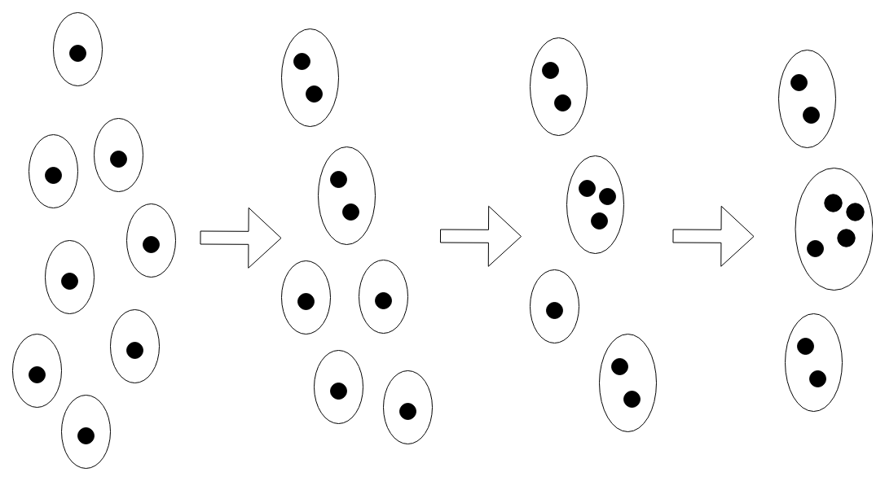
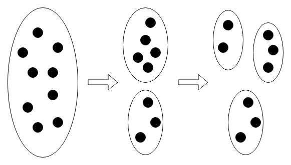
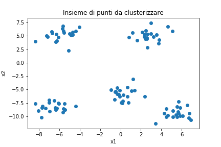
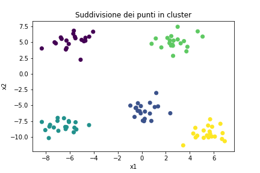
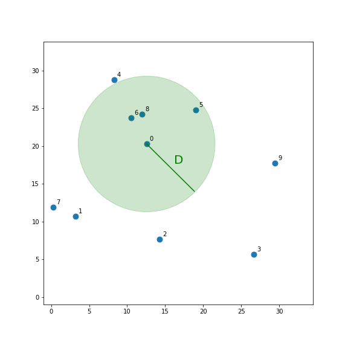
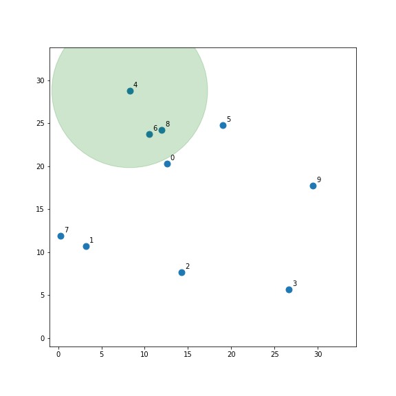
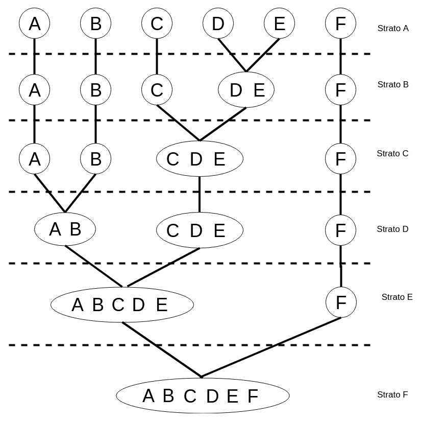
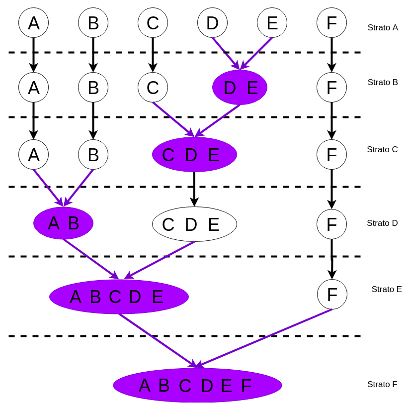
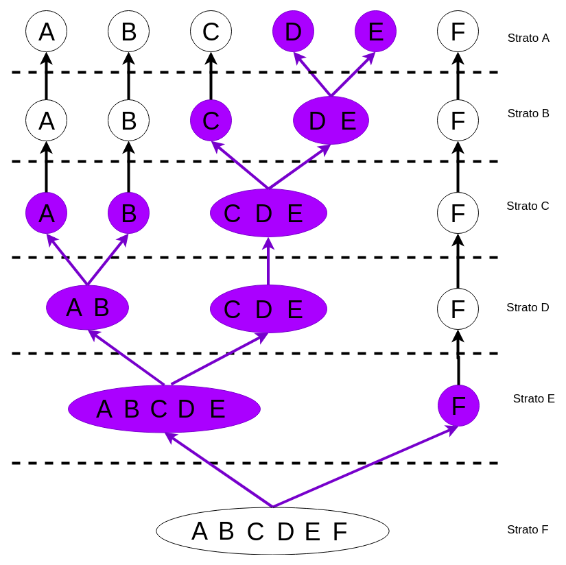

# Introduzione alla Cluster Analysis

In questo articolo vengono descritti i concetti di base della **Cluster Analysis** ed alcuni tra gli algoritmi più importanti e rappresentativi delle tecniche principali ad oggi utilizzate. Lo scopo è quello di far comprendere la finalità della suddivisione in cluster ed i meccanismi che si celano dietro la loro costruzione.

## Le origini
Quando Robert Tryon iniziò i suoi studi sulla psicologia comportamentale aveva forse sognato, come tutti i ricercatori, che almeno una delle sue teorie o idee potessero un giorno essere tramandate ai posteri. Nella fattispecie il suo studio sull’intelligenza come tratto genetico nei mammiferi ha, effettivamente, lasciato il segno nel campo della biologia, ma il suo metodo di analisi lo portò, forse involontariamente, a influenzare un ramo delle scienze matematiche oggi più che mai sulla cresta dell’onda: la statistica.
Robert Tryon, infatti, fu uno dei primi scienziati a utilizzare quello che lui chiamò la **Cluster Analysis**, la quale mantenne questo nome per i decenni a venire.

La Cluster Analysis è ad oggi uno degli strumenti più potenti e utilizzati tra quelli che pendono dalla cintura degli attrezzi di statistici e Data Scientist. Ma prima di spiegare in cosa consiste risponderemo ad una domanda che si pone spesso chi vi si imbatte per la prima volta.

## Cos’è un cluster?

Per chi lavora nel campo dell'informatica (a prescindere dal ruolo) il termine cluster può far pensare a molte cose, ad esempio a un cluster di una rete di computer.
Il termine, di per sé, sta a indicare un **raggruppamento** di oggetti che hanno uno o più caratteristiche in comune.

Prendiamo ad esempio un insieme di individui.
Se di questi individui conosciamo unicamente il colore degli occhi, possiamo suddividere il gruppo in un numero di cluster pari al numero di colori. Quindi avremo un cluster contenente tutti gli individui con gli occhi azzurri, un altro contenente gli individui con gli occhi verdi e così via.

E’ possibile estendere questo ragionamento a un numero maggiore di attributi. Immaginiamo che ogni individuo nel nostro insieme indossi una maglietta rossa o blu.
Forti di questo nuovo attributo, possiamo creare una nuova suddivisione in cluster per raggruppare tutti gli individui con gli occhi azzurri e la maglietta rossa, gli occhi azzurri e la maglietta blu, gli occhi verdi e la maglietta rossa e così via.
Quindi, in sostanza, preso un insieme di oggetti aventi un certo numero di attributi, questi possono essere utilizzati per separare gli oggetti in un numero qualunque di cluster.

## Clustering vs Classification

Definito in questo modo il cluster assomiglia molto a un altro famoso membro della famiglia del Machine Learning: la classe.
Anche una classe raccoglie al suo interno una serie di oggetti aventi caratteristiche in comune;
la differenza sta principalmente nella tecnica utilizzata per definire di quale gruppo fa parte un determinato oggetto.

Quando si effettua una **classificazione** si hanno una serie di classi (categorie) note a priori e lo scopo è quello di capire a quale gruppo appartiene un oggetto osservando il valore dei suoi attributi.
Per fare questo, durante la fase di addestramento di un artefatto (modello) di classificazione, si parte da un insieme di oggetti dei quali si conosce già la categoria di appartenenza. Attraverso l’analisi degli attributi degli oggetti appartenenti a una determinata classe si cerca di trovare un pattern comune. 
La classificazione è, quindi, un procedimento di [**apprendimento supervisionato**](https://en.wikipedia.org/wiki/Supervised_learning) dove la conoscenza di una determinata categoria esiste a prescindere dagli oggetti in essa raggruppabili.

Nella **clusterizzazione**, invece, si vuole estrapolare un certo numero di gruppi in cui è possibile separare gli oggetti di un insieme analizzando i valori dei loro attributi. In questo caso non esistono classi predeterminate né esempi che le rappresentino. L’algoritmo deve riuscire a identificare gli oggetti che "si somigliano" e raggrupparli tra loro.
Di conseguenza la clusterizzazione è un [**algoritmo di tipo non supervisionato**](https://en.wikipedia.org/wiki/Unsupervised_learning).

## Tecniche di clustering
Un algoritmo di clustering è, quindi, in grado di raggruppare tra loro oggetti che hanno caratteristiche simili. **Come riesce a raggiungere questo scopo?**

Esistono più tecniche che permettono di clusterizzare un insieme di oggetti. Una prima importante suddivisione dipende dalla tecnica di generazione dei cluster stessi, che divide gli algoritmi in due categorie:

* **Algoritmi di clusterizzazione agglomerativi** (*bottom-up*) 
	Iniziano inserendo ogni oggetto dell’insieme in un proprio cluster per poi raggrupparli iterativamente fino al raggiungimento di una condizione specifica (es. numero di cluster desiderato).
* **Algoritmi di clusterizzazione divisivi** (*top-down*) 
	Iniziano inserendo tutti gli oggetti dell’insieme in un unico cluster per poi separarlo iterativamente in cluster più piccoli fino al raggiungimento di una condizione specifica.

Il risultato finale, in entrambi i casi, è un insieme di cluster contenenti uno o più oggetti.

|  | 
|:--:| 
| *Fig 1. Clusterizzazione agglomerativa.* |

|  | 
|:--:| 
| *Fig 2. Clusterizzazione divisiva.* |

A prescindere dall’approccio utilizzato, gli algoritmi di clustering si basano tutti su una **metrica**, puramente geometrica, che permetta di identificare quanto simili siano due oggetti fra di loro.
Infatti gli oggetti in esame vengono visti come insiemi di valori reali che ne rappresentano le caratteristiche (colore degli occhi, altezza, peso, ecc.). Questi valori, a loro volta, possono essere raggruppati in modo da formare dei [vettori](https://en.wikipedia.org/wiki/Vector_(mathematics_and_physics)#Vectors_in_Euclidean_geometry) che rappresentino punti in uno spazio euclideo.

Tornando all’esempio della classificazione di individui consideriamo, questa volta, solamente l’altezza e il peso.
Immaginiamo che il nostro insieme sia composto dalle seguenti persone:

*Han:*  
&nbsp;&nbsp;&nbsp;&nbsp;&nbsp;&nbsp;&nbsp;Altezza: 180 cm 
&nbsp;&nbsp;&nbsp;&nbsp;&nbsp;&nbsp;&nbsp;Peso: 75 kg 
*Leia:* 
&nbsp;&nbsp;&nbsp;&nbsp;&nbsp;&nbsp;&nbsp;Altezza: 160 cm 
&nbsp;&nbsp;&nbsp;&nbsp;&nbsp;&nbsp;&nbsp;Peso: 50 kg 
*Chewbacca:* 
&nbsp;&nbsp;&nbsp;&nbsp;&nbsp;&nbsp;&nbsp;Altezza: 210 cm 
&nbsp;&nbsp;&nbsp;&nbsp;&nbsp;&nbsp;&nbsp;Peso:130 kg 

Se consideriamo l’altezza come prima coordinata ed il peso come seconda, questi tre individui possono essere rappresentati dai seguenti vettori e quindi visualizzabili in uno spazio euclideo (in questo caso di sole due dimensioni).

Han: (180, 75) 
Leia: (160, 50) 
Chewbacca: (210, 130) 

|  | 
|:--:| 
| *Fig 3. Visualizzazione sul piano cartesiano di Leia, Han e Chewbacca in funzione dell’altezza e del peso.* |

Maggiore è il numero degli attributi, maggiori saranno le dimensioni dello spazio in questione. Una volta che gli oggetti dell’insieme sono associati a punti nello spazio è possibile verificarne la "somiglianza" attraverso il concetto di **distanza**: più due punti sono vicini più saranno simili.

Le metriche principalmente utilizzate sono :

* [Distanza euclidea](https://en.wikipedia.org/wiki/Euclidean_distance).
* [Distanza Manhattan](https://en.wikipedia.org/wiki/Taxicab_geometry).
* [Distanza di Hamming](https://en.wikipedia.org/wiki/Hamming_distance).

## K-means

L’algoritmo **K-means** è probabilmente la tecnica di clusterizzazione più famosa (ed un caso particolare dell’[algoritmo di Lloyd](https://en.wikipedia.org/wiki/Lloyd%27s_algorithm)).

Il K-means è utilizzato in moltissimi campi, come la computer vision e la geostatistica, sia per la sua semplicità di implementazione che per le elevate performance che lo caratterizzano.
È un algoritmo di tipo iterativo che raffina la suddivisione degli oggetti a ogni ciclo e che si basa sul concetto di **centroide**.

### Centroidi

Un centroide è un punto nello spazio che rappresenta, sostanzialmente, un cluster e che corrisponde al punto medio dei punti del cluster stesso. Nell’esempio in Fig. 4 sono rappresentati due cluster con i rispettivi centroidi disegnati in rosso.

|  | 
|:--:| 
| *Fig 4. Cluster con relativi centroidi evidenziati in rosso.* |

Da sottolineare il fatto che, anche se a volte, come vedremo più avanti, nella fase di costruzione dei cluster la posizione di un centroide può coincidere con quella di un oggetto, in generale **il centroide non è un oggetto in essi contenuto**.

**ALGORITMO K-MEANS (PSEUDOCODICE)**

**Input:** 
&nbsp;&nbsp;&nbsp;&nbsp;&nbsp; $N$ oggetti caratterizzati da vettori di dimensione $d$ 
&nbsp;&nbsp;&nbsp;&nbsp;&nbsp;Un intero $C$ che rappresenta il numero di cluster desiderati 
&nbsp;&nbsp;&nbsp;&nbsp;&nbsp; $C$ vettori di dimensione d che rappresentano i centroidi rappresentativi dei cluster iniziali. 

**Repeat:** 
&nbsp;&nbsp;&nbsp;&nbsp;&nbsp;Step 1 (**Assignment**): 
&nbsp;&nbsp;&nbsp;&nbsp;&nbsp;&nbsp;&nbsp;&nbsp;&nbsp;&nbsp;Assegna ogni oggetto al cluster il cui centroide ha la distanza euclidea più bassa (in sostanza il più vicino). 
&nbsp;&nbsp;&nbsp;&nbsp;&nbsp;Step 2 (**Update**): 
&nbsp;&nbsp;&nbsp;&nbsp;&nbsp;&nbsp;&nbsp;&nbsp;&nbsp;&nbsp;Per ogni cluster calcolare il punto medio delle osservazioni a esso associate; questo punto sarà il centroide di questo cluster per l’iterazione successiva. 

Il numero di iterazioni dipende dalla metodologia che si vuole adottare. È possibile decidere un numero fisso di iterazioni, oppure fare in modo che l’algoritmo esca dal ciclo subito dopo una iterazione nella quale nessun oggetto ha subito un cambiamento di cluster o quando si raggiunge un numero massimo di iterazioni.

### Inizializzazione dell’algoritmo K-means

La scelta dei centroidi iniziali è un fattore che influenza molto il risultato finale, in quanto il K-means non garantisce il raggiungimento dell’ottimo globale (il miglior risultato possibile), ma può attestarsi in un punto di **ottimo locale**, ossia la configurazione di cluster migliore che gli è possibile raggiungere date le condizioni iniziali.

Due procedure tipiche sono scegliere degli oggetti dall’insieme da clusterizzare (**Forgy method**) oppure dei punti a caso nello spazio.
Un meccanismo ulteriore di inizializzazione, chiamato **Random Partition**, consiste nell’assegnare in maniera casuale ogni oggetto a un cluster per poi procedere con lo step di update, facendo in modo che i punti dei centroidi iniziali corrispondano con le medie degli oggetti assegnati.

### K-means++

Nell'ambito della ricerca atta a migliorare le performance dell'algoritmo K-means, nel 2007 David Arthur e Sergei Vassilvitskii idearono [un metodo di inizializzazione](http://ilpubs.stanford.edu:8090/778/1/2006-13.pdf) che chiamarono K-means++.
L'idea su cui si basa la loro tecnica consiste nel costruire un set di centroidi iniziali che siano il più "sparpagliati" possibile.

**ALGORITMO K-MEANS++ (PSEUDOCODICE)**

**Input:** 
&nbsp;&nbsp;&nbsp;&nbsp;&nbsp;Un insieme $I$ di $N$ oggetti da clusterizzare 
&nbsp;&nbsp;&nbsp;&nbsp;&nbsp;Un intero $C$ che rappresenta il numero di cluster desiderati

**Repeat:** 
&nbsp;&nbsp;&nbsp;&nbsp;&nbsp;**Step 1**: Scegliere randomicamente un oggetto in $I$ ed eleggerlo a centroide 
&nbsp;&nbsp;&nbsp;&nbsp;&nbsp;Repeat $C-1$ times: 
&nbsp;&nbsp;&nbsp;&nbsp;&nbsp;&nbsp;&nbsp;&nbsp;&nbsp;&nbsp;**Step 2**: Per ogni punto $i$ dell'insieme $I$ calcolare la distanza $D(i)$ dal centroide più vicino tra quelli costruiti fino a questo momento. 
&nbsp;&nbsp;&nbsp;&nbsp;&nbsp;&nbsp;&nbsp;&nbsp;&nbsp;&nbsp;**Step 3**: Scegliere un punto $j$ in $I$ con una probabilità che sia proporzionale al quadrato della distanza $D(j)$ ed eleggerlo a centroide.

Questa procedura di inizializzazione ha dato risultati sorprendenti, dimostrando, in alcuni casi, di saper aumentare notevolmente le performance dell'algoritmo K-means, anche di svariati ordini di grandezza, oltre a raggiungere il risultato finale molto più velocemente.

### Esempio di utilizzo del K-means

Nella prima delle figure in basso sono disegnati alcuni punti distribuiti in uno spazio a due dimensioni.

|  | 
|:--:| 
| *Fig 5. Insieme di punti nello spazio cartesiano.* |

A seguito della clusterizzazione tramite K-means i punti vengono suddivisi in cinque cluster, evidenziati in figura con colori diversi.

|  | 
|:--:| 
| *Fig 6. Suddivisione in 5 cluster tramite K-means.* |

Modificando i parametri dell'algoritmo possiamo avere risultati diversi, infatti se decidiamo di generare solamente due cluster invece che cinque ricaveremo la situazione rappresentata nell'immagine sottostante.

|  | 
|:--:| 
| *Fig 7. Sudidvisione in 2 cluster tramite K-Means.* |

!!! È possibile visionare il codice usato per questo esempio sul notebook [Colab](https://colab.research.google.com/drive/1GNb9tO_tt6e9ye6ALSEB_TIXos2RD8Oh) associato all'articolo.

## Quality Threshold (QT) clustering algorithm

Mentre il K-means affonda le sue radici negli anni ‘60, l’algoritmo QT (Heyer et al., 1999) è di invenzione più recente ed è stato inizialmente utilizzato per l’analisi delle sequenze genetiche.
Al contrario del suo collega più anziano non richiede di specificare il numero di cluster da generare né un insieme iniziale di centroidi da cui partire.
Richiede invece in input una **distanza soglia** e un numero minimo di oggetti per cluster.
A ogni iterazione vengono costruiti una serie di cluster candidati, dei quali solamente uno sarà selezionato come vincitore. Il vincitore viene memorizzato per essere restituito al completamento del ciclo e i suoi punti rimossi prima dell’iterazione successiva.

**ALGORITMO QUALITY THRESHOLD (PSEUDOCODICE)**

**Input :**  
&nbsp;&nbsp;&nbsp;&nbsp;&nbsp;Distanza di soglia $D$. 
&nbsp;&nbsp;&nbsp;&nbsp;&nbsp;Numero minimo di oggetti per cluster $m$. 

**Repeat**: 
&nbsp;&nbsp;&nbsp;&nbsp;&nbsp;Step 1: Per ogni oggetto dell’insieme si costruisce un cluster inserendovi, oltre all’oggetto in questione, anche tutti gli oggetti che hanno una distanza da questo inferiore a $D$. Si costruisce così un insieme di cluster candidati. 
&nbsp;&nbsp;&nbsp;&nbsp;&nbsp;Step 2: Se non esiste nessun cluster che abbia un numero di oggetti superiore  a $m$ viene costruito un cluster per oggetto e l’algoritmo termina. 
&nbsp;&nbsp;&nbsp;&nbsp;&nbsp;Step 3: Dall’insieme di cluster candidati si sceglie quello con il numero maggiore di oggetti. Il cluster viene considerato vincitore e gli oggetti contenuti rimossi.

Per comprendere meglio lo step 1 si può fare riferimento alla Fig. 8 che rappresenta la fase in cui si sta analizzando il cluster candidato costruito attorno al punto 0.

|  | 
|:--:| 
| *Fig 8. Cerchio di raggio D che rappresenta l’area di cattura dei punti per la creazione del cluster candidato attorno al punto 0.* |

La parte colorata in verde rappresenta l’area del cerchio che ha il punto 0 come centro e raggio $D$.
In questo caso entrano a far parte del cluster candidato, oltre al punto 0 stesso, anche i punti 6, 8, e 5.
Vediamo cosa accade quando costruiamo il cluster candidato attorno al punto 4.

|  | 
|:--:| 
| *Fig 9. Cerchio di raggio D che rappresenta l’area di cattura dei punti per la creazione del cluster candidato attorno al punto 4.* |

In questo caso i punti inclusi nel cluster sono 4, 6 e 8. 
Avendo solamente 3 punti, contro i 4 del caso precedente, questo cluster non sarà sicuramente il vincitore di questa iterazione.

L’algoritmo descritto rende questo metodo un’alternativa al K-Means e i suoi derivati, che si distinguono per differenti metriche e tecniche di identificazione dei centroidi iniziali, ma mantengono il processo originale.
Ma, per quanto innovativa, l’idea di base del QT clustering, pur rendendolo un degno avversario del K-Means, non lo elegge a suo successore.
Infatti il QT clustering, anche se non richiede di indicare una ipotesi iniziale dei cluster, richiede comunque di indicare un numero minimo di oggetti che questi devono contenere e una distanza soglia.
Inoltre ha una **maggiore complessità computazionale** e risulta essere più lento: lentezza che aumenta con l’aumentare del numero di oggetti dell’insieme iniziale e del numero minimo di oggetti per cluster.
Nonostante questo, l’algoritmo QT ha un vantaggio rispetto al K-Means, e consiste nel fatto che, a ogni iterazione, vengono presi in considerazione tutti i cluster possibili (limitatamente ai vincoli imposti all’inizio dell’elaborazione).

Se prendiamo i punti disegnati in figura 5 e li clusterizziamo tramite l'algoritmo QT usando una distanza soglia di 3 e un numero minimo di 10 elementi per cluster avremo un risultato identico a quello in Fig. 6.

Anche in questo caso è possibile visionare un esempio di implementazione dell'algoritmo in Python sul notebook [Colab](https://colab.research.google.com/drive/1GNb9tO_tt6e9ye6ALSEB_TIXos2RD8Oh) associato all'articolo.

## Clustering gerarchico

Il clustering gerarchico è un'altra tecnica di clusterizzazione nella quale invece di costruire semplicemente un insieme di cluster, come visto fino ad ora, viene costruita una gerarchia di cluster, rappresentabile tramite un [dendrogramma](https://en.wikipedia.org/wiki/Dendrogram).

|  | 
|:--:| 
| *Fig 10. Grafo a strati che rappresenta una possibile suddivisione gerarchica in cluster.* |

In Fig. 10 si vede un esempio di clusterizzazione gerarchica.
Nel primo strato in alto gli oggetti sono tutti separati: per ognuno di essi esiste un cluster che li contiene in modo esclusivo. Questa configurazione rappresenta il caso in cui le regole di somiglianza tra i punti sono così ristrette che non esistono due punti che possano essere raggruppati nello stesso cluster.
Man mano che si scende verso i livelli più bassi alcuni cluster vengono a fondersi tra di loro diventando sempre più popolosi.
Effettuando un "taglio" ad una determinata altezza si ottiene una particolare configurazione di cluster: ad esempio se decidessimo di tagliare l'albero all'altezza dello strato D avremo tre cluster, mentre allo strato B ne avremo 5.
Come nel caso della clusterizzazione non gerarchica, anche qui esistono due tecniche di generazione dei cluster: **agglomerativa** (bottom-up) e **divisiva** (top-down). Inoltre, anche in questo caso, possono essere utilizzate diverse metriche per calcolare la distanza tra i punti e, in aggiunta, la distanza tra cluster (**linkage criterion**).

### Tecnica agglomerativa

Gli algoritmi di clusterizzazione gerarchica agglomerativi sono processi iterativi che, ad ogni iterazione, accorpano fra loro una coppia di cluster creandone così uno nuovo.
Un esempio di algoritmo di clusterizzazione agglomerativo è il **single-linkage** clustering, dove il termine single-linkage fa riferimento al linkage criterion utilizzato.
In questo algoritmo la distanza tra cluster corrisponde alla distanza minima fra due punti non appartenenti allo stesso cluster. A ogni iterazione i due cluster più vicini vengono fusi tra loro.
Osservando la Figira 10  è chiaro che l’algoritmo partirebbe quindi dallo strato A per poi scendere verso il basso.
Nell’implementazione di un algoritmo di clusterizzazione agglomerativa non è strettamente necessario tenere traccia degli attributi degli oggetti. Quello che spesso si fa è costruire una **matrice delle distanze**, dove ogni colonna e ogni riga corrispondono a un cluster. La matrice risultante è simmetrica rispetto alla diagonale, la quale ha tutti valori pari a zero.

<table>
  <tr>
    <th></th>
    <th>A</th>
    <th>B</th>
    <th>C</th>
    <th>D</th>
  </tr>
  <tr>
    <td>A</td>
    <td>0</td>
    <td>0.3</td>
    <td>1.4</td>
    <td>2</td>
  </tr>
  <tr>
    <td>B</td>
    <td>-</td>
    <td>0</td>
    <td>2.9</td>
    <td>6</td>
  </tr>
  <tr>
    <td>C</td>
    <td>-</td>
    <td>-</td>
    <td>0</td>
    <td>0.7</td>
  </tr>
  <tr>
    <td>D</td>
    <td>-</td>
    <td>-</td>
    <td>-</td>
    <td>0</td>
  </tr>
</table>
<figcaption>Tab. 1. Esempio di matrice delle distanze tra punti.</figcaption>

Nell’esempio nella Tab. 1 il cluster A ha una distanza di 1.4 dal cluster C.

Al termine di una iterazione, le righe e le colonne corrispondenti ai cluster che si sono uniti vengono fuse tra loro e le distanza ricalcolate.

|  | 
|:--:| 
| *Fig 11. Esempio di clusterizzazione di tipo agglomerativa.* |

Sul notebook [Colab](https://colab.research.google.com/drive/1GNb9tO_tt6e9ye6ALSEB_TIXos2RD8Oh) legato a questo articolo è possibile vedere un esempio di clusterizzazione agglomerativa con scikit-learn.

Altri algoritmi notevoli di clusterizzazione gerarchica agglomerativa sono:

* [Complete-linkage clustering](https://en.wikipedia.org/wiki/Complete-linkage_clustering).
* [UPGMA](https://en.wikipedia.org/wiki/UPGMA).
* Minimum energy clustering (che utilizza la [Energy distance](https://en.wikipedia.org/wiki/Energy_distance)). 

### Tecnica divisiva

Gli algoritmi di clusterizzazione gerarchici divisivi lavorano essenzialmente in maniera inversa rispetto a quelli agglomerativi. Di conseguenza lo stato di partenza è un unico cluster contenente tutti gli oggetti dell’insieme e, ad ogni iterazione, uno dei cluster viene diviso in due e i suoi oggetti distribuiti. Facendo riferimento alla Figura 10 l’algoritmo partirebbe dallo strato F per poi salire verso l’alto. La tecniche di selezione del cluster e di ripartizione degli oggetti sono specifiche di ogni implementazione.

|  | 
|:--:| 
| *Fig 12. Esempio di clusterizzazione di tipo divisiva.* |

## Conclusioni

Esistono molte altre tecniche di clusterizzazione che non sono state toccate in questo articolo, nel quale ho cercato di dare una panoramica sugli algoritmi principali e sulle idee sulle quali si basano.
In un periodo nel quale gli algoritmi di machine learning supervisionato sono alla ribalta è importante ricordare che esistono molti altri strumenti ancora validi e fondamentali che sono di supporto all'analisi dei dati.
