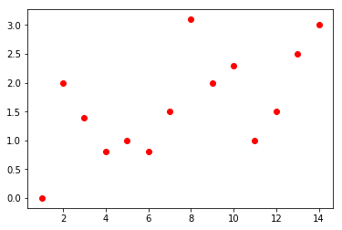
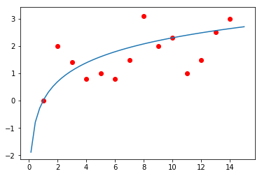
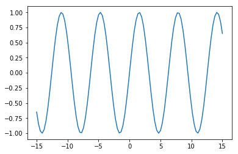
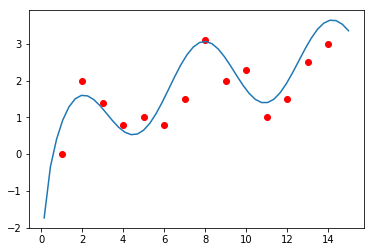
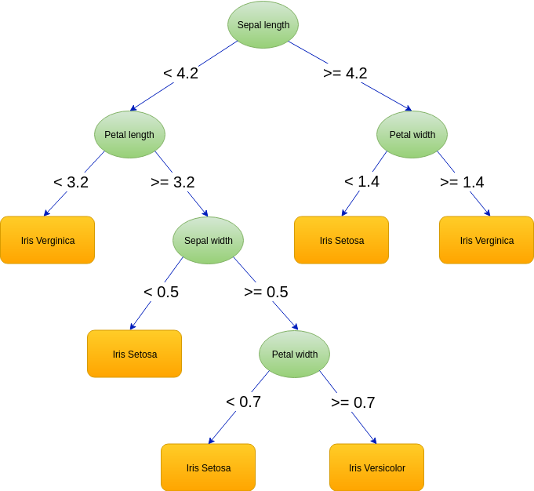
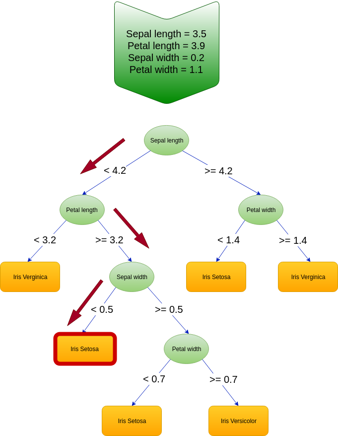
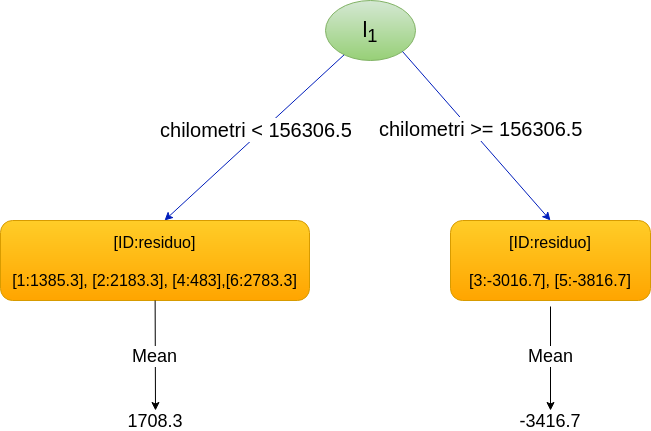

# Gradient Boosting

In questo articolo viene trattato uno storico algoritmo di ottimizzazione di tipo [ensemble](https://en.wikipedia.org/wiki/Ensemble_learning): il **Gradient Boosting**.
Saranno descritte la teoria di base sulla quale questo algoritmo poggia e si cercherà di darne una descrizione quanto più possibile intuitiva attraverso un esempio pratico di regressione.

## Cosa è il Boosting?

Quante persone occorrono per avvitare una lampadina?

La domanda, e l'ovvia risposta, sono il punto di partenza di una comunissima barzelletta adattata di volta in volta a soggetti diversi (ingegneri, geometri, fisici, ecc.) per ridicolizzarne le peculiarità pensando alle bizzarre e curiose metodologie che ciascuna di queste categorie userebbe per risolvere il problema.

*Quanti ingegneri servono per cambiare una lampadina? Meglio nessuno: passerebbero tutto il tempo a capire perché si è bruciata.* Dal punto di vista dell’ironia (se vogliamo definirla tale) le numerose varianti su questa barzelletta si basano su stereotipi (gli ingegneri cercano sempre di capire come funzionano o perché non funzionano le cose) e su soluzioni paradossali. Eppure un quesito non ironico basato sullo stesso principio porta ad interrogativi interessanti.

Consideriamo, ad esempio: *quanti babbuini servono per avvitare una lampadina?* La risposta potrebbe non essere così banale. Il problema per il babbuino non è l’operazione di sostituzione della lampadina in sé. Scommetto che, se propriamente addestrato, un babbuino sarebbe del tutto in grado di avvitare una lampadina senza alcun bisogno di assistenza. Cambiamo allora leggermente la natura della domanda: *quanti babbuini servono per __imparare__ ad avvitare una lampadina?*
Il problema è cambiato: la complessità del quesito non è più legata alle abilità manuali necessarie all’avvitamento della lampadina, ma alla comprensione del meccanismo di avvitamento in sé.

Onde evitare di offendere gli amanti dei babbuini che stanno leggendo questo articolo (e anche per gestire più agevolmente questa premessa) cambiamo il soggetto della frase: *quanti Ewok sono necessari per cambiare una lampadina?* Gli [Ewok](https://it.wikipedia.org/wiki/Ewok) sono esseri intelligenti, ma decisamente poco pratici nell'uso della tecnologia, il che li rende poco adatti a svolgere un compito del genere. Però possiamo contare sul fatto che sono esseri sociali e che, collaborando, possano in qualche modo arrivare ad una soluzione.

Uno di loro potrebbe intuire il verso corretto di inserimento, un altro potrebbe capire che non è il caso di stringere troppo il vetro onde evitare che si rompa mentre un altro ancora potrebbe scoprire il movimento rotatorio necessario al completamento del lavoro. In questo caso tre Ewok sono stati in grado di compiere un’impresa impossibile per un solo Ewok, dimostrando quindi che l’unione fa la forza (dando allo stesso tempo una parziale risposta alla domanda originale - servono almeno tre Ewok!).

Nel 1988 [Michael Kearns](https://en.wikipedia.org/wiki/Michael_Kearns_(computer_scientist)) e [Leslie Gabriel Valiant](https://en.wikipedia.org/wiki/Leslie_Valiant) si posero un quesito simile al nostro. Non erano molto interessati allo studio sulle capacità degli Ewok (non sappiamo in che rapporto siano i due con i film di Lucas) ma erano invece particolarmente interessati ai modelli di apprendimento automatico, e quello che si chiesero fu: “Can a set of weak learners create a single strong learner?”, ossia, con liberissima traduzione, “Può un insieme di modelli di apprendimento deboli creare un singolo modello forte?”

Sostanzialmente i due ricercatori si chiesero se per i modelli di apprendimento automatico, così come per gli Ewok, “l’unione facesse la forza”. In questo contesto un *weak learner* è un modello che genera delle risposte appena appena migliori di quelle che si otterrebbero in modo casuale, mentre uno *strong learner*, come intuibile, è un modello che si avvicina di molto ad un modello ideale. La risposta positiva al quesito di Kearns e Valiant arrivò solo un paio di anni dopo e darà il via allo studio di modelli di previsione ottenuti tramite la composizione di vari modelli più semplici (*ensemble models*).

## Boosting algorithms

Il Boosting è un meta-algoritmo iterativo che detta le linee guida sul come collegare tra loro un insieme di Weak Learner per creare uno Strong Learner. Ma come è possibile estrapolare una buona risposta partendo dalle risposte di un insieme di modelli deboli? Il segreto del successo di questo paradigma si cela nella costruzione iterativa degli Strong Learner, nella quale ogni step corrisponde all’inserimento di un Weak Learner che ha lo scopo di “aggiustare il tiro” partendo dai risultati ottenuti dai suoi predecessori. In fase di previsione il risultato dello Strong Learner finale sarà la somma dei risultati dei Weak Learner in esso contenuti.

Il concetto non è dissimile dal costruire la formula di una funzione complessa sommando tra loro un insieme di funzioni elementari. Immaginiamo di avere l'insieme di osservazioni in Figura 1 e di voler costruire una funzione (modello) che li approssimi.

|  | 
|:--:| 
| *Fig 1. Insieme casuale di osservazioni lungo un piano.* |

A occhio e croce le osservazioni non hanno un andamento lineare e tendono a crescere leggermente spostandosi lungo l'asse x. Facciamo un primo tentativo utilizzando una funzione che sembra avere, grossomodo, lo stesso andamento: $\log(x)$.

|  | 
|:--:| 
| *Fig 2. Funzione logaritmica passante per punti su un piano.* |

La funzione $\log(x)$ riesce ad attraversare la nuvola composta dalle nostre osservazioni, ma passa decisamente lontana da alcune di esse. Per riuscire a migliorare il nostro modello dovremmo far sì che tenda a salire e scendere in maniera ciclica in modo da avvicinarsi a più punti. Questa caratteristica ondulatoria fa subito pensare alla funzione che è caratteristica degli andamenti oscillatori: la funzione $\sin(x)$.

|  | 
|:--:| 
| *Fig 3. Funzione seno.* |

Come è possibile dare alla nostra funzione $\log$ le caratteristiche ondulatorie della funzione $\sin$?

Se costruiamo la funzione:

$$
\mathbf{f(x)} = \log(x) + \sin(x)
\tag{1}
$$

questa risulterebbe avere il seguente andamento:

|  | 
|:--:| 
| *Fig 4. Funzione composita passante per punti su un piano.* |

Questa nuova funzione è crescente come la funzione $\log$ ma è anche ondulatoria come la funzione $\sin$. Si potrebbe affermare che la funzione $\sin$, una volta sommata alla $\log$, ne corregga l'andamento per renderla più adatta a modellare le osservazioni di partenza.

Essendo i Learner stessi delle funzioni matematiche è possibile operare nella stessa maniera, sommandoli tra di loro in modo da aggiustare l'andamento dello Strong Learner finale e modellarlo nella forma che vogliamo. Come detto all'inizio gli algoritmi di Boosting sono iterativi, ossia costruiscono lo Strong Learner in un ciclo nel quale, ad ogni iterazione, viene costruito un Weak Learner che viene aggiunto a quelli già presenti per comporre un **modello**. Da questo punto in poi si definirà come modello la composizione di un certo numero di Weak Learner. Il modello costruito all'ultima iterazione corrisponderà allo Strong Learner finale.

Chiamiamo $\mathbf{L_n(x)}$ la funzione corrispondente al modello costruito allo step **n**. In base a quanto detto finora la sua formula può essere scritta come:

$$
\mathbf{L_n(x)} = L_{n-1}(x) + l_n(x)
\tag{2}
$$

dove $l_n(x)$ è un generico Weak Learner e $L_{n-1}$ è il modello costruito nell'iterazione precedente. Chiamando con $l_0$ un generico Weak Learner iniziale si può definire un modello nel modo seguente:

$$
\mathbf{L_n(x)} = l_{0}(x) + l_{1}(x) + ... +l_{n}(x)
\tag{3}
$$

o in maniera più concisa:

$$
\mathbf{L_n(x)} = \sum_{i=0}^n l_i(x)
\tag{4}
$$

Il Boosting, come detto, è un meta-algoritmo. In quanto tale lascia ampio margine di manovra per quanto riguarda la natura dei modelli da utilizzare. Anche se, in genere, il Boosting è implementato utilizzando dei modelli ad albero decisionale, questo non significa che non possa essere implementato basandosi su altre funzioni matematiche. Un esempio notevole di implementazione dell’algoritmo di Boosting è il Gradient Boosting, che è il protagonista del resto dell’articolo.

## Gradient Boosting

Il Gradient Boosting è una implementazione dell'algoritmo di Boosting, dal quale eredita la logica di costruzione di uno Strong Learner. I modelli che vengono utilizzati sono, generalmente, alberi decisionali e il suo scopo è quello di minimizzare una generica [funzione di costo](https://en.wikipedia.org/wiki/Loss_function).

### Alberi decisionali

Un albero decisionale (decision tree) è un tool di supporto alle decisioni basato su una struttura ad albero (per l'appunto), e che può essere usato (e spesso lo è) come base per algoritmi di classificazione o regressione.

Usiamo come esempio un caso di studio particolarmente amato da chi studia Machine Learning: [Iris Dataset](https://it.wikipedia.org/wiki/Dataset_Iris). Questo dataset descrive una serie di fiori di genere Iris fornendo le dimensioni dei petali e dei sepali e li raggruppa in tre specie differenti. Chi di voi (come il sottoscritto la prima volta che ha avuto a che fare con questo dataset) non ha idea di cosa sia un sepalo, può scoprirlo [qui](https://it.wikipedia.org/wiki/Sepalo) e farsi bello con gli amici.

|  | 
|:--:| 
| *Fig 5. Albero decisionale* |

In Figura 5 è rappresentato un esempio di albero decisionale già istruito. È possibile vedere come ogni nodo faccia riferimento a un determinato attributo del dataset e come venga diviso in due nodi figli in funzione del valore di questo. La descrizione dell'algoritmo di apprendimento di un albero di decisione esula dallo scopo di questo articolo.

Immaginiamo ora, forti del modello in Figura 5, di voler capire a quale specie di Iris fa parte il seguente fiore:

Sepal length = 3.5 
Petal length = 3.9 
Sepal width = 0.2 
Petal width = 1.1

Una volta dato in pasto questo esempio all'albero questo inizierà a muoversi dall'alto verso il basso, partendo quindi dal nodo radice, decidendo, di volta in volta, in quale nodo figlio spostarsi in funzione del valore degli attributi del fiore in input.

In Figura 6 è evidenziato il tragitto percorso per il nostro fiore di esempio, che ci porterà a concludere che questo fa parte della specie "Iris Setosa".

|  | 
|:--:| 
| *Fig 6. Tragitto di predizione lungo albero decisionale* |

## Compriamo un'auto usata

Vediamo un esempio di utilizzo del Gradient Boosting in un caso di regressione: il calcolo del valore di una automobile in funzione dei chilometri percorsi. Lo scopo del modello sarà quello di minimizzare la funzione di costo [Mean Squared Error](https://en.wikipedia.org/wiki/Mean_squared_error) (MSE).

| ID | Chilometri  | Prezzo (Y)  |
|--- |-------------|-------------|
| 1  | 112900      | 14200       |
| 2  | 122182      | 15000       |
| 3  | 181400      | 9800        |
| 4  | 131231      | 13300       |
| 5  | 190522      | 9000        |
| 6  | 125452      | 15600       |

Per affrontare questo problema dobbiamo innanzitutto decidere quale funzione di partenza ($f_0$) utilizzare, ossia, facendo riferimento all'esempio fatto in precedenza sulla costruzione di una funzione attraverso la somma di funzioni elementari, dobbiamo scegliere il nostro equivalente della funzione $\log(x)$.

Per capire quale posizione iniziale è la migliore dobbiamo concentrarci sullo scopo finale del modello, ossia minimizzare il MSE:

$$
\mathbf{MSE} = \frac{1}{n}\sum_{i=1}^{n}(Y_i-\hat{Y}_i)^2
\tag{5}
$$

dove $n$ è il numero di autovetture, $Y_i$ è il prezzo della i-esima autovettura, e $\hat{Y}_i$ è il prezzo che il modello ha predetto. L'argomento della sommatoria, ossia la differenza tra un valore osservato e un valore stimato, viene in genere chiamato **residuo** (residual). Dovendo noi minimizzare la funzione di costo, lo scopo dell'algoritmo sarà quello di abbassare iterativamente il valore assoluto di tutti i residui (ossia farli tendere a zero).

Il valore che minimizza questa formula è, nel nostro caso, la media dei prezzi delle automobili su cui stiamo addestrando il modello, ossia:

$$
L_0 = \frac{1}{n}\sum_{i=1}^{n}x_i
\tag{6}
$$

Quindi il nostro modello prevederà per ognuna delle vetture lo stesso valore corrispondente a 12816,7.

| ID | Chilometri  | Prezzo (Y)  | $L_0$   |
|--- |-------------|-------------|---------|
| 1  | 112900      | 14200       | 12816.7 |
| 2  | 122182      | 15000       | 12816.7 |
| 3  | 181400      | 9800        | 12816.7 |
| 4  | 131231      | 13300       | 12816.7 |
| 5  | 190522      | 9000        | 12816.7 |
| 6  | 125452      | 15600       | 12816.7 |

A questo punto si calcolerà quanto queste "previsioni" siano distanti dal valore reale osservato. 

| ID | Chilometri  | Prezzo (Y)  | $L_0$   | $Y-L_0$ (residuo)  |
|--- |-------------|-------------|---------|--------------------|
| 1  | 112900      | 14200       | 12816.7 |  1383.3            |
| 2  | 122182      | 15000       | 12816.7 |  2183.3            |
| 3  | 181400      | 9800        | 12816.7 | -3016.7            | 
| 4  | 131231      | 13300       | 12816.7 |  483.3             |
| 5  | 190522      | 9000        | 12816.7 | -3816.7            |
| 6  | 125452      | 15600       | 12816.7 |  2783.3            |

Terminata questa prima fase passiamo all'iterazione successiva, nella quale si aggiungerà un Weak Learner ( $l_1$ ) che verrà istruito a prevedere la variazione del valore precedentemente previsto, affinché questo si avvicini al valore desiderato.

Da sottolineare qui una questione importante: <u>il nuovo Weak Learner non sarà una versione migliorata di quelli che lo precedono</u>. Se così fosse il nuovo learner potrebbe completamente soppiantare quelli vecchi rendendoli inutili. Invece, mentre $L_k$ ha come scopo quello di prevedere **il valore del prezzo**, $l_{k+1}$ ha l'obbiettivo di predire e aggiungere **la variazione sui valori del prezzo** calcolato da $L_k$.

|  | 
|:--:| 
| *Fig 7. Albero decisionale di regressione* |

La prima operazione che viene eseguita per la creazione di $l_1$ è quella di analizzare le feature in output (prezzo) e trovare tramite queste un valore di confine della feature *chilometri* che separi gli esempi in due gruppi. In questo esempio viene calcolato come valore di confine 156306,5.
A questo punto il nodo principale viene diviso in due nodi figli che andranno ad accogliere i due gruppi. Visto che lo scopo dell'albero è calcolare le variazioni da apportare ai prezzi stimati, vengono presi i valori dei residui $y-L_0$ e se ne calcola la media: questi saranno i valori stimati da questo albero.

I valori di $l_1$, in base alla formula (2) devono essere aggiunti ad $L_0$ per calcolare $L_1$
Una volta note le predizione del nuovo modello possiamo calcolare i nuovi residui.

| ID | $l_1$  |$L_1$ |$Y - L_1$ (residuo)|
|----|--------|------|-------------------|
|1   |1708.3  |14525 | -325              |
|2   |1708.3  |14525 |  475              |
|3   |-3416.7 |9400  |  400              |
|4   |1708.3  |14525 | -1225             |
|5   |-3416.7 |9400  | -400              |
|6   |1708.3  |14525 |  1075             |

Questo procedimento dovrà essere effettuato più volte, perfezionando a ogni step le predizioni del modello generale. Alla fine di ogni step non tutti i residui vengono migliorati. Nell'esempio che abbiamo appena mostrato, il residuo del prezzo della macchina 4 è peggiorato (ha un valore assoluto maggiore) rispetto a quello calcolato allo step precedente. Questo non deve far pensare a un errore nell'algoritmo ma dipende dal fatto che abbiamo effettuato una sola iterazione. Le successive iterazioni apporteranno ulteriori modifiche e l'andamento generale del valore assoluto dei residui risulterà discendente.

## Ma che fine ha fatto il mean squared error?

In effetti in tutta la descrizione precedente non appare la formula del mean squared error da nessuna parte, ma lo abbiamo menzionato solamente per la scelta della funzione $F_0$.
In verità il MSE lo abbiamo avuto sotto gli occhi tutto il tempo!
Come è stato ripetuto più volte, il modo attraverso il quale il Gradient Boosting costruisce lo Strong Learner è la minimizzazione del valore dei residui $Y-F_k$, dove $F_k$ è lo Strong Learner costruito allo step k.

È possibile dimostrare che la derivata parziale della funzione MSE rispetto a una generica previsione $\hat{Y}_k$ è la sequente:

$$
\frac {\partial}{\partial\hat{Y}_k}\left(\frac{1}{n}\sum_{i=1}^{n}(Y_i-\hat{Y}_i)^2\right) = Y- \hat{Y}_k
\tag{7}
$$

ossia proprio i residui che stiamo minimizzando.

Chi tra i lettori conosce già gli elementi base del Machine Learning avrà riconosciuto un vecchio amico: il gradient boosting ottimizza i propri risultati attraverso il meccanismo del [Gradient Descent](https://en.wikipedia.org/wiki/Gradient_descent), ossia minimizzando il gradiente della funzione di costo.

È possibile utilizzare altre funzioni di costo che non siano il MSE.
In questo caso saranno necessari due modifiche all'algoritmo spiegato nell'esempio precedente:

1. La funzione $L_0$ dovrà essere scelta cercando di minimizzare la nuova funzione di costo.
2. La formula per il calcolo dei residui andrà sostituita con la derivata parziale della nuova funzione di costo.

Il resto del procedimento resterà inalterato.

## Incremental Shrinkage

Come tutti gli algoritmi di machine learning anche il Gradient Boosting è soggetto a un fenomeno conosciuto e odiato da tutti i Data Scientist del mondo: l'overfitting.
Per chi non avesse idea di cosa si tratti, possiamo dire che l'overfitting è la tendenza che ha un algoritmo a "memorizzare" gli esempi del training set, diventando incredibilmente bravo quando si tratta di predirne i valori, ma che gli impedisce di generalizzare al di fuori di questi.
Dato che lo scopo finale di un modello è proprio quello di fare previsioni partendo da valori di input che siano diversi da quelli di training, è chiaro come l'overfitting sia un fenomeno da evitare.

Uno dei metodi che vengono utilizzati nel Gradient Boosting è l'**incremental shrinkage**.
Questo metodo consiste nell'aggiunta di una costante moltiplicativa $\lambda$, chiamata **learning rate**, al valore di uscita dei Weak Learners.
La formula di calcolo di $L_n$ diviene quindi:

$$
\mathbf{L_n(x)} = L_{n-1}(x) + \lambda l_n(x)
\tag{8}
$$

dove $\lambda \in (0,1]$

È una nota best practice cercare di utilizzare un valore di $\lambda$ pari a 0.1 e di abbassarne il valore gradualmente durante la fase di learning.

## Stochastic Gradient Boosting

Una piccola variante del Gradient Boosting, ispirata a un cugino dell'algoritmo di boosting, il [bagging method](https://en.wikipedia.org/wiki/Bootstrap_aggregating), è lo Stochastic Gradient Boosting.
In questa implementazione l'algoritmo come lo abbiamo descritto non subisce modifiche, ma cambia la metodologia con la quale gli esempi del training set vengono sottoposti ai Weak Learners. Nella versione tradizionale ogni Weak Learner viene addestrato utilizzando tutti i valori di input generati nell'iterazione precedente. Nell'SGD, invece, ogni qual volta un Weak Learner viene addestrato gli viene sottoposto solamente un sottoinsieme di questi. 
Ovviamente, una volta istruito, viene utilizzato per calcolare le variazioni su tutti gli esempi del training set per creare i valori di input per l'iterazione successiva.
Normalmente viene campionato il 50% degli elementi totali e questo meccanismo non solo previene l'insorgere dell'overfitting, ma accelera anche l'elaborazione complessiva.

## Utilizzo attuale del Gradient Boosting

Nonostante siano passati quasi venti anni dalla nascita degli algoritmi di boosting il Gradient Boosting è ancora un modello predittivo largamente utilizzato.
Basti pensare che, nonostante i riflettori siano oggi tutti puntati sul paradigma delle reti neurali, in molte competizioni online (come quelle ospitate su [Kaggle](https://www.kaggle.com/)) sono molte le soluzioni vincenti basate su questo algoritmo.

In particolare sembra essere molto amata una implementazione nata come parte della [DMLC](https://github.com/dmlc) (Distributed Machine Learning Community) implementata da Tianqi Chen: [XGBoost](https://xgboost.readthedocs.io/en/latest/).
Con il passare degli anni questa libreria risultò tanto apprezzata da vantare un numero elevato di implementazioni in svariati linguaggi tra i quali Python, Scala, R e Java e l’integrazione in molti framework di Data Flow come Apache Spark e Hadoop.
È possibile vedere una implementazione di una Gradient Boosting Machine con la libreria XGBoost sul [notebook](https://colab.research.google.com/drive/1vKkp38NOpuB1lfUWl2YkBhZgIUo9jWYI) legato all'articolo.

## Conclusioni

Il Gradient Boosting è tuttora riconosciuto come un valido strumento per classificazione e regressione e si trova spesso a competere a testa alta con tecniche più recenti e sponsorizzate, sia per le sue solide basi teoriche sia per la semplicità di utilizzo concessa dalle implementazioni esistenti. Per chi volesse approfondire l'argomento consiglio l'articolo scritto da Terence Parr e Jeremy Howard ["How to explain gradient boosting"](https://explained.ai/gradient-boosting/), dal quale sono state ispirate parti di questo articolo,  o, se preferite una lettura più accademica, potete far riferimento ai seguenti papers:

* [Boosting Algorithms as Gradient Descent](http://papers.nips.cc/paper/1766-boosting-algorithms-as-gradient-descent.pdf)
* [Boosting Algorithms as Gradient Descent in Function Space](https://www.maths.dur.ac.uk/~dma6kp/pdf/face_recognition/Boosting/Mason99AnyboostLong.pdf)
* [Stocastic Gradient Boosting](https://statweb.stanford.edu/~jhf/ftp/stobst.pdf)

