In questo articolo viene descritto l'algoritmo [YOLO](https://pjreddie.com/darknet/yolo/) per Object Detection. Ne vengono definite le caratteristiche fondamentali facendo qualche riferimento ai progressi che si sono conseguiti nella varie versioni rilasciate.

[MINITOC]

## Vivo o morto ...

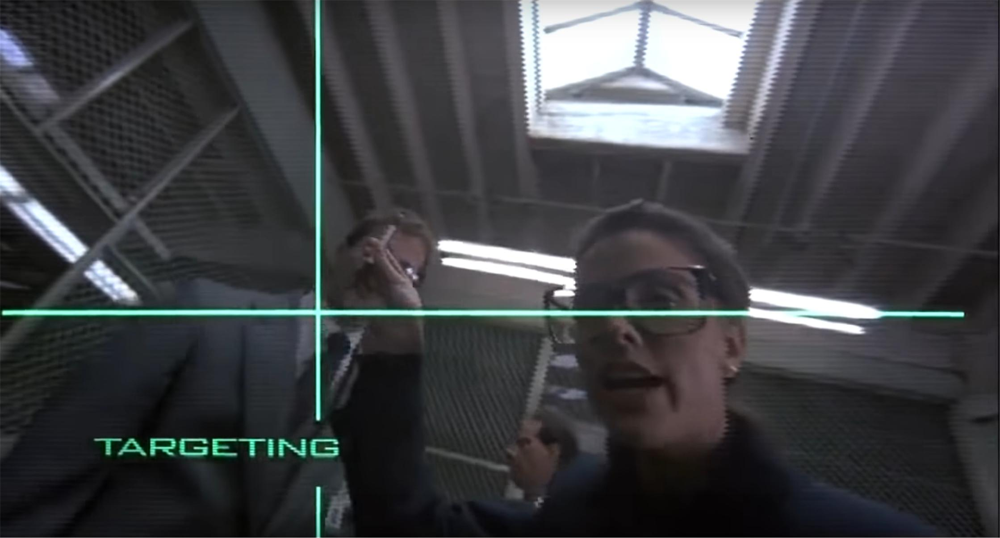

L’agente Murphy è seduto su una sedia circondato dagli scienziati che avevano lavorato su di lui per mesi. Le scritte del boot di sistema erano appena scomparse alla vista quando la dottoressa Tyler avvicina la propria faccia alla sua. “Dammi una griglia”, chiede ad uno dei suoi colleghi. Una croce di colore verde appare appare davanti agli occhi di Murphy. Ok... non è proprio una griglia, ma passiamoci sopra. La dottoressa mostra una penna davanti agli occhi di Murphy e dice:

“Bersaglio”

Il centro della croce si sposta nella posizione della penna. La dottoressa la sposta di nuovo.

“Bersaglio”

La croce, come fatto precedentemente, si sposta nella nuova posizione. Tutti sono soddisfatti: test riuscito.

Quella appena descritta è una delle scene del film **Robocop** del 1987, quando questi si sveglia dopo essere stato costruito e subisce un rapido quanto poco probabile, test di funzionalità. Erano gli anni '80 e messa così sembrava una delle cose più fenomenali che si potessero chiedere ad un robot (nella fattispecie ad un cyborg, ma meglio chiudere qui questa parentesi o non ne usciamo più). Le scienze informatiche erano alle prime affascinanti applicazioni pratiche e l’intelligenza artificiale prevalentemente appannaggio, per l’appunto, della science fiction. Inoltre chi si approcciava alla suddetta pellicola lo faceva per le sparatorie e le scene splatter, non per porsi quesiti tecnici sulla fattibilità di quanto visto. Ma la scena rimane comunque alquanto interessante se si cerca davvero di investigare su cosa “realmente” sta avvenendo.

## Bersaglio!

La dottoressa Tyler richiama, con questo ordine, l’attenzione di Murphy sulla penna che gli ha posto davanti agli occhi.

Ora... la capacità di comprendere che con la parola “bersaglio” si faccia riferimento alla penna e non alla faccia della dottoressa o ad una delle persone sullo sfondo, esula dallo scopo di questo articolo (come tante altre cose viste in questa scena) e quindi ci limiteremo a supporre che Murphy sia in grado di capire questo in quanto parzialmente umano o in quanto personaggio principale di un film! Semplifichiamo il caso d’uso e fingiamo che la dottoressa abbia, in realtà, detto la parola “penna”.

## Penna!

Nel momento in cui la parola viene associata all’oggetto Murphy analizza ciò che gli si para davanti, localizza la penna, e sposta la croce digitale sulla sua posizione.

Quello che per un essere umano armato di joystick risulta un task estremamente banale, non lo è comunque per il povero Murphy, costretto a far girare un modello di analisi delle immagini sul processore che gli hanno impiantato in testa che sarà, nella migliore delle ipotesi, un [Intel 80386](https://it.wikipedia.org/wiki/Intel_80386).

Il problema che deve affrontare infatti è tutt’altro che banale ed è oggi conosciuto come **Object Detection**.

## Object Classification e Object Detection.

Supponiamo che la dottoressa Tyler gli avesse posizionato la penna davanti agli occhi e avesse chiesto a Murphy: “Che cosa vedi?”. In questo caso il dominio del problema è limitato all’unico oggetto presente nell’area visiva di Murphy, la nostra penna, e l’unica domanda sensata è chiedere di riconoscerla come tale.

Questo problema, leggermente meno complesso di quello descritto prima, è noto come **Object Classification** e consiste nell’associare una immagine ad una determinata categoria: un cane, una giraffa, un paesaggio, una stilografica, ecc.

Questo problema prevede come dominio di analisi solo le immagini che contengono un elemento principale da riconoscere. Se il nostro Murphy ha imparato a riconoscere un gatto in una fotografia, non possiamo pretendere che ci riesca con una immagine contenente una colonia felina, in quanto il soggetto dell’immagine (tanti gatti) gli è sconosciuto.
Il problema dell’Object Classification è stato ampiamente studiato negli ultimi anni raggiungendo ottimi risultati tramite l’ausilio di Reti Neurali Convolutive e loro derivate.

Purtroppo, però, questi modelli tendono a non funzionare bene nei casi in cui l’oggetto da riconoscere non occupa una porzione importante all’interno dell’immagine e, soprattutto, non sono in grado di localizzarlo, ossia di individuarlo attraverso, per esempio, una coppia di coordinate, come si farebbe per indicare un punto su una mappa.

Immaginiamo che l’agente Murphy sia stato addestrato a riconoscere solamente un piccolo insieme di oggetti, una penna, un telefono e un paio di occhiali, e che sia in grado di riconoscerne solamente uno per immagine.
Quali sono i dati che Murphy dovrebbe restituire all’algoritmo della sua interfaccia visiva affinché possa identificare e localizzare la penna?
Negli algoritmi di Object Detection le reti neurali vengono spesso istruite per restituire un vettore del tipo:

\begin{equation} 
\begin{bmatrix}
    p_c \\
    b_x \\
    b_y \\
    b_w \\
    b_h \\
    c_1 \\
    c_2 \\
    c_3
\end{bmatrix}
\tag{1}
\end{equation}

Dove:

$p_c$ = probabilità che l’immagine contenga uno degli oggetti riconosciuti  
$b_x$ = coordinata x del centro dell'oggetto  
$b_y$ = coordinata y del centro dell'oggetto  
$b_w$ = larghezza del box contenente l’oggetto riconosciuto  
$b_h$ = altezza del box contenente l’oggetto riconosciuto  
$c_1$ = probabilità che l’oggetto appartenga alla classe 1  
$c_2$ = probabilità che l’oggetto appartenga alla classe 2  
$c_3$ = probabilità che l’oggetto appartenga alla classe 3  

Una volta restituito questo vettore l’interfaccia visiva di Murphy sarebbe in grado di disegnare un box contenente l'oggetto come mostrato in figura Fig. 1:

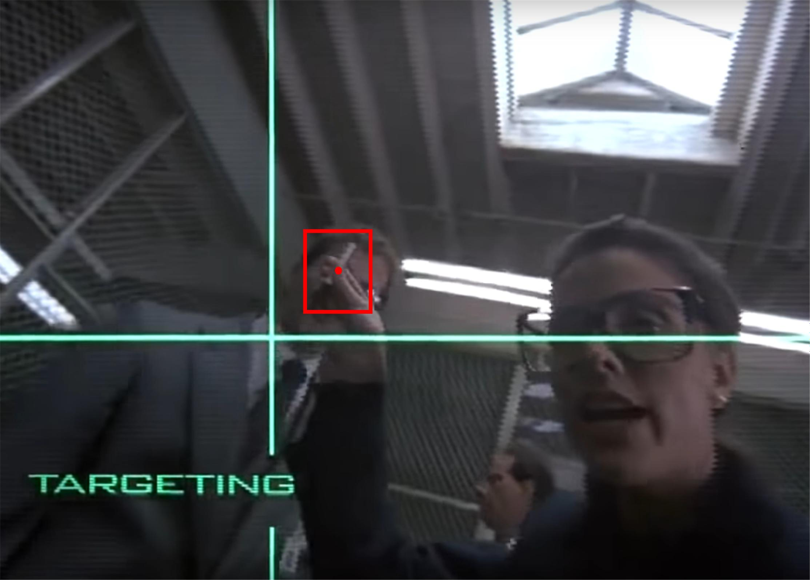
<figcaption>
Figura 1. Box contenente il bersaglio "penna".
</figcaption>

Ovviamente per addestrare una rete neurale a riconoscere e  localizzare un oggetto in questa maniera sarebbe necessario avere un training set di immagini con dei box già conosciuti.
Se volessimo partire invece da un training set di immagini contenenti un solo elemento importante (una penna, un telefono, un paio di occhiali o un bicchiere), molto più semplici da reperire, dovremmo trovare una via alternativa per localizzare gli oggetti in questione su una immagine di input.

La soluzione più semplice, che è stata una di quelle più utilizzate in passato per risolvere questo problema, consisteva nella suddivisione dell’immagine in immagini più piccole che venivano  poi date in pasto ad un modello di Object Classification.
Questa metodologia è nota come **Sliding Window**.

## Sliding Window

Con questo nome è indicato un metodo di sintesi dell’immagine dalla quale vengono ritagliate porzioni più piccole.

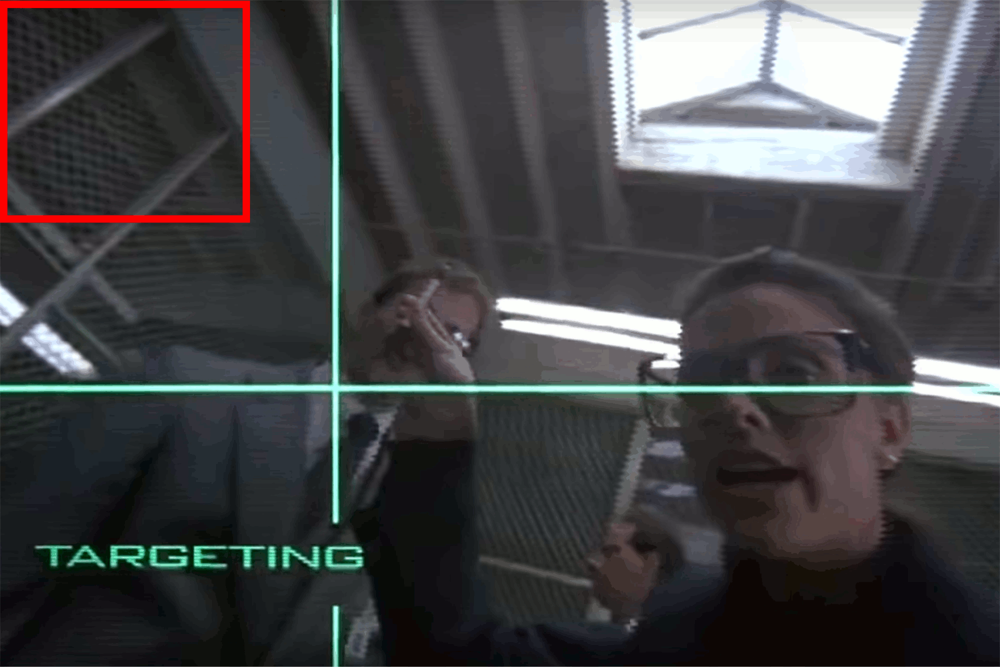
<figcaption>
Figura 2. Scansione dell'immagine con sliding window alla ricerca della penna
</figcaption>

Nell’immagine Fig. 2 si può vedere una finestra rettangolare che scorre lungo l’immagine da sinistra a destra e dall’alto in basso, selezionando, di volta in volta, una diversa porzione dell’immagine originale.
Sostanzialmente, quello che viene fatto è una scansione lineare dell’immagine alla ricerca di oggetti conosciuti. Se all’interno di una finestra viene riconosciuto un oggetto, allora non solo potremmo dire che quell’oggetto è presente nell’immagine, ma anche indicarne la posizione.
Nell’immagine in Fig. 3 è rappresentato un esempio di Rete Neurale Convolutiva per Object Classification che andrebbe ad analizzare ogni singola finestra:

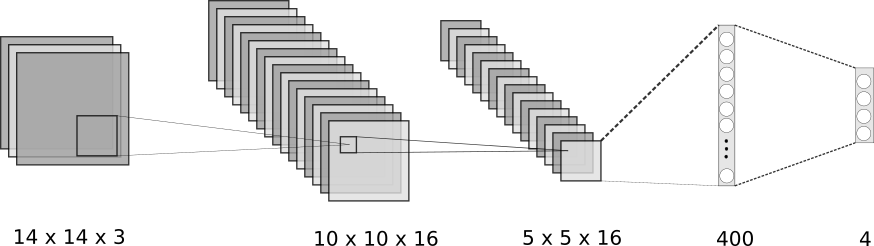
<figcaption>
Figura 3. Rete neurale convolutiva per object classification
</figcaption>

Il layer di output contiene 4 neuroni di uscita, uno per ognuna delle quattro classi riconosciute: penna, telefono, occhiali e bicchiere.

Questa tecnica, ad una prima occhiata molto funzionale, presenta però dei difetti.
In particolare ogni oggetto riconoscibile tramite questo metodo deve avere due caratteristiche principali: deve avere una dimensione adatta per rientrare nella finestra di scansione e non deve trovarsi in una posizione tale da finire sulla linea di demarcazione tra due finestre adiacenti. Nell'esempio in figura Fig. 2, infatti, sono presenti un paio di occhiali, ma non rientrando in nessuna delle finestre utilizzate non vengono riconosciuti dall'algoritmo.

Per ovviare a questo problema è necessario effettuare più scansioni con diverse dimensioni della finestra e step di avanzamento.
Quando le immagini erano analizzate da semplici modelli lineari questo metodo, per quanto composto da molti step, richiedeva comunque dei tempi di esecuzione accettabili.
Le moderne Reti Convolutive riescono a dare risultati decisamente migliori rispetto ai modelli più vecchi, ma hanno tempi di elaborazioni più lunghi e sono più avidi di risorse macchina, di conseguenza la metodologia Sliding Window non è più conveniente.

Fortunatamente non esiste una vera rivalità tra questo metodo e le Reti Convolutive tanto che proprio queste ultime gli hanno permesso di esistere in una forma più performante.

## Sliding window "convolutive"

La soluzione ideale sarebbe poter utilizzare più finestre contemporaneamente. Il problema di questa idea è che se decidiamo di suddividere l’immagine in, diciamo, venti finestre allora sarebbe necessario far girare venti reti neurali contemporaneamente. Il povero Murphy è fortemente limitato dalla tecnologia del periodo in cui è stato inventato quindi è il caso di trovare una soluzione più snella.

Questa soluzione è, in realtà, insita nella natura stessa delle Reti Convolutive.
Lungi dal voler illustrare il meccanismo sul quale queste reti si basano ci limiteremo a ricordare che l’idea di base è quella di un filtro che scorre lungo l’immagine in maniera affatto dissimile da quella di una sliding window.
Ma per far si che questi due algoritmi si comportino davvero allo stesso modo dovremo apportare la seguente modifica alla rete descritta in Fig 3: dare una spintarella agli ultimi due layer e farli cadere a terra. Il risultato è mostrato in figura Fig. 4.

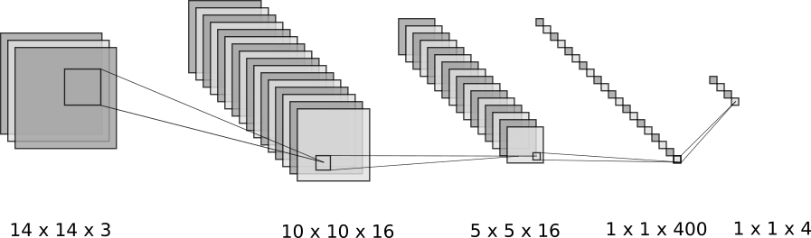
<figcaption>
Figura 4. Rete neurale convolutiva con layer di output 1x1x4.
</figcaption>

Sostanzialmente abbiamo trasformato i layer fully connected in layer convolutivi. Inoltre questa rete può ancora essere utilizzata per effettuare Image Classification, in quanto continua a restituire 4 valori, uno per ogni signola classe.

Si potrebbe pensare a questo come ad un piccolo e alquanto futile esercizio di stile fin quando non proviamo a dare in pasto alla rete un’immagine di dimensioni maggiori di quelle usate per l’addestramento, ad esempio 16x16.
Ovviamente il risultato finale avrà dimensioni leggermente differenti da quelli prodotti in fase di training: 2x2x4

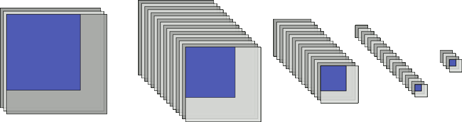
<figcaption>
Figura 5. Trasporto delle informazioni tramite i layer di una rete convolutiva.
</figcaption>

E qui la magia viene incontro all'agente Murphy.
Sostanzialmente i valori dei canali di ogni singolo elemento del volume di output possono essere interpretati come dei vettori 4x1 come quelli prodotti in Fig 4 e ognuno di questi corrisponde al risultato che avrebbe dato una sliding window di dimensioni 14x14.

In figura in Fig. 5 è possibile vedere come le informazioni dell'area evidenziata in blu dell'immagine di input vengano processate dalla rete fino al popolamento del layer di output. 
Quindi utilizzando una sola rete neurale siamo riusciti ad avere i risultati che si sarebbero ottenuti con quattro reti del tipo  descritto in Fig. 3 applicati a quattro posizioni diverse di una sliding window.

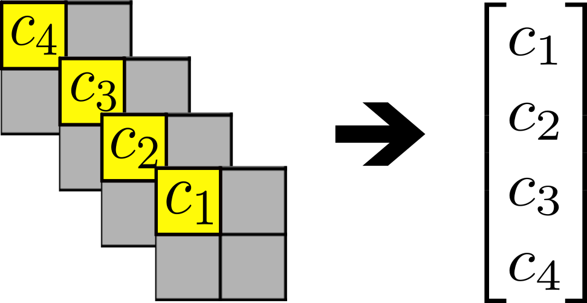
<figcaption>
Figura 6. Interpretazione dei valori nel layer di output.
</figcaption>

Ingrandendo il layer finale in figura Fig. 6 sono stati evidenziati in giallo gli elementi che corrispondono all'output della predizione sulla finestra convolutiva in alto a sinistra dell'immagine di input e che rappresentano la probabilità di appartenenza dell'immagine ad una delle quattro classi conosciute.

Ora l’agente Murphy è in grado di identificare più rapidamente un oggetto ma la cattura delle Bounding Box continua a risultare poco accurata in quanto vincolata dalla forma (in questo esempio quadrata) e dalla dimensione delle finestre "convolutive".
Nel caso degli occhiali, infatti, la regione da questi occupata non è quadrata, ma più che altro rettangolare come mostrato in Fig 7.

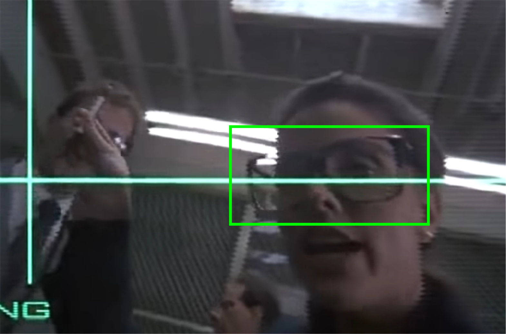
<figcaption>
Figura 7. Bounding Box legata all'oggetto "occhiali".
</figcaption>

## You Only Look Once

La soluzione a questo problema, nella nostra linea temporale, è stata ideata da Joseph Redmon , Santosh Divvala , Ross Girshick e Ali Farhadi e si chiama YOLO.

YOLO (You Only Look Once) permette di riconoscere più oggetti e, allo stesso tempo, di identificarne la posizione e lo spazio occupato effettuando una sola “lettura” dell’immagine di input.
Questo algoritmo, ideato inizialmente nel 2016 ha subito qualche modifica fino ad arrivare, nel 2018, alla versione 3.

### Divide et ... e niente, solo divide

Per riuscire a trovare la penna utilizzando lo YOLO il nostro Murphy dovrà inizialmente effettuare una suddivisione dell’immagine da esaminare in una griglia (una vera questa volta), che a scopo illustrativo sarà 3x3, ma che in generale può avere una dimensione qualunque.

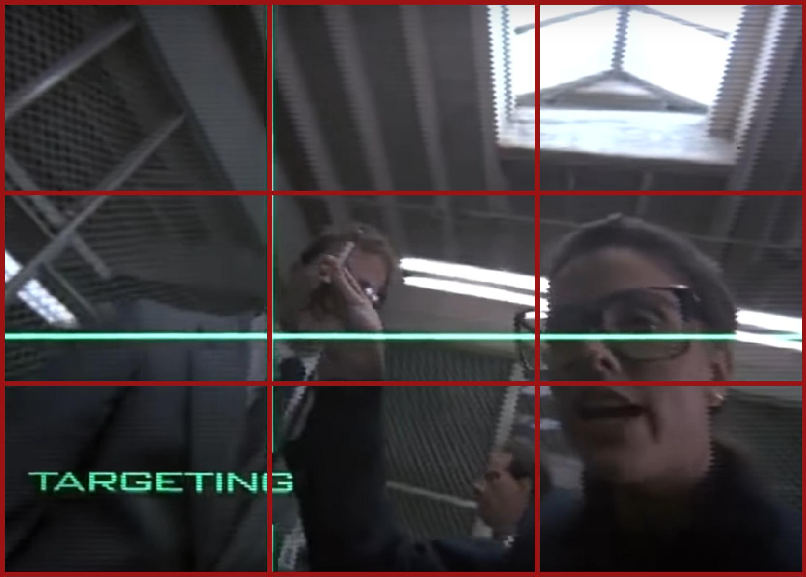
<figcaption>
Figura 8. Griglia YOLO 3x3.
</figcaption>

A questo punto l’immagine verrà esaminata attraverso una Rete Convolutiva con l’ausilio delle sliding window "convolutive" considerando ogni singola cella come una finestra.

Nell'esempio in Fig. 5 la rete aveva lo scopo di effettuare Image Classification, di conseguenza il numero di canali del volume di output era uguale a 4 (il numero di oggetti riconoscibili). Se volessimo invece effettuare una Object Detection dovremo invece fare in modo di costruire il vettore (1). In questo caso la dimensione del volume in uscita non sarà più 1x1x4, ma 1x1x8.

In figura è visualizzato un esempio di cosa l’agente Murphy vedrebbe a seguito della richiesta di “bersaglio”.

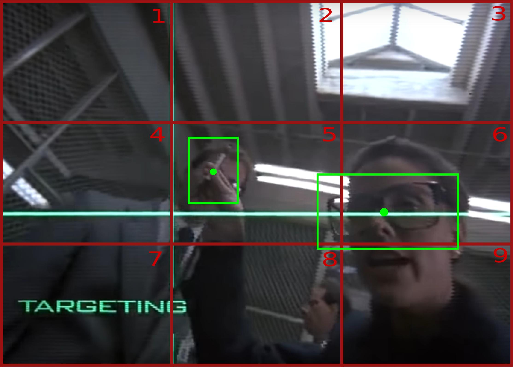
<figcaption>
Figura 9. Griglia YOLO 6x6 con oggetti identificati e relativi Bounding Box.
</figcaption>

In figura Fig. 9 vediamo che Murphy è stato in grado di riconoscere la penna nel box 5, come era già stato in grado di fare, ma anche di riconoscere gli occhiali nel box 6.
Ad ogni immagine viene associato un Bounding Box ed un punto centrale. La posizione del punto centrale determina il box al quale l'oggetto viene associato.

Nella cella 6 è possibile vedere che la Bounding Box associata agli occhiali non è limitata ai margini della cella, ma sfora nelle celle adiacenti.
I valori inseriti nel vettore in (1) sono relativi alla cella ma ne parleremo nel dettaglio più avanti.
Una rete che si trova ad analizzare l'immagine restituirà un volume di output come quello in Fig. 10 dove viene evidenziato il box al quale un determinato vettore fa riferimento.

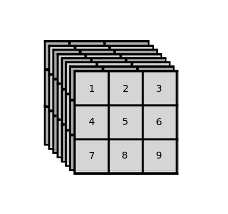
<figcaption>
Figura 10. Esempio di volume di output della rete YOLO.
</figcaption>

Un notevole risultato per un cyborg degli anni '80, ma ora siamo nel 21° secolo! Possibile che non siamo riusciti a creare nulla di meglio?
Immaginiamo che l’agente Murphy si ritrovi davanti la scena seguente:

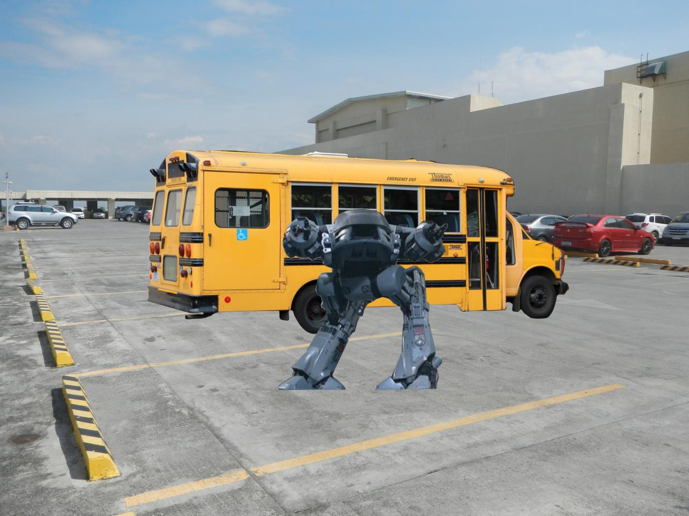
<figcaption>
Figura 11. Minaccioso ED-209.
</figcaption>

La nemesi di Robocop, [ED-209](https://it.wikipedia.org/wiki/ED209), lo fronteggia minaccioso. Robocop dovrà decidere quale azioni intraprendere: attaccare o fuggire.
Immaginiamo che Murphy utilizzi un algoritmo di Object Detection come quello descritto finora. Probabilmente il risultato sarebbe qualcosa del genere:

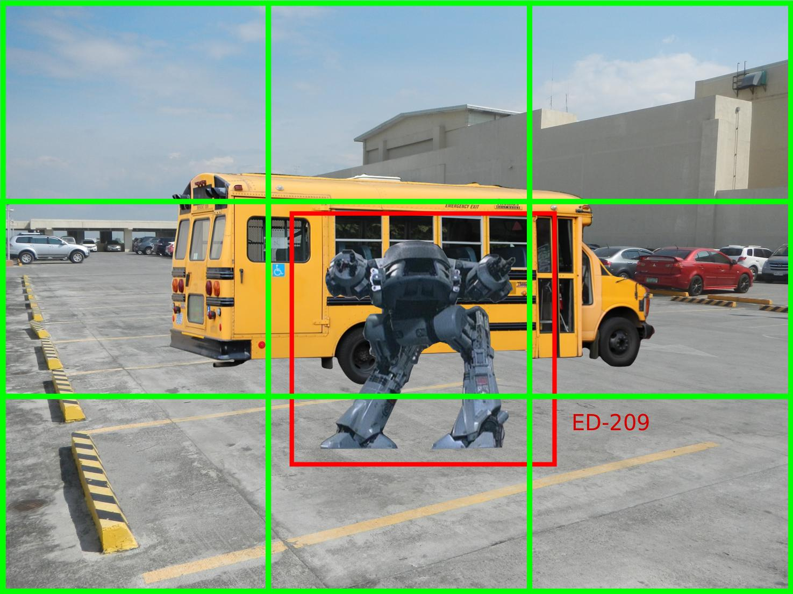
<figcaption>
Figura 12. ED-209 localizzato nel box centrale
</figcaption>

Nel box centrale viene riconosciuto ED-209, di conseguenza Robocop inizierebbe a sparare come non ci fosse un domani!

Anche i meno acuti tra voi avranno però notato che dietro al robot è parcheggiato uno scuolabus, potenzialmente pieno di bambini. Probabilmente ingaggiare in conflitto a fuoco non è la migliore delle ipotesi. Purtroppo Murphy non è in grado di riconoscere lo scuolabus in quanto parzialmento coperto dal robot rivale il quale occupa la porzione più importante dello slot centrale. Inoltre al momento è comunque solo in grado di riconoscere un solo oggetto per box, come visibile anche dalla struttura del vettore di output (1), quindi se anche riconoscesse lo scuolabus ignorerebbe completamente il robot, facendo di conseguenza una brutta fine.

A salvaguardare la salute dei bambini di Detroit (e di Murphy stesso) verranno in soccorso dei costrutti chiamati Anchor Box.

## Anchor Box

Introdotti in YOLO v2 gli Anchor Box hanno permesso di poter riconoscere più oggetti all’interno di una singola cella.
Una Anchor Box corrisponde ad una particolare forma (shape) nella quale far rientrare un oggetto riconosciuto (o meglio la sua Bounding Box).
Supponiamo a scopo illustrativo di prendere in considerazione gli Anchor Box definiti di seguito.

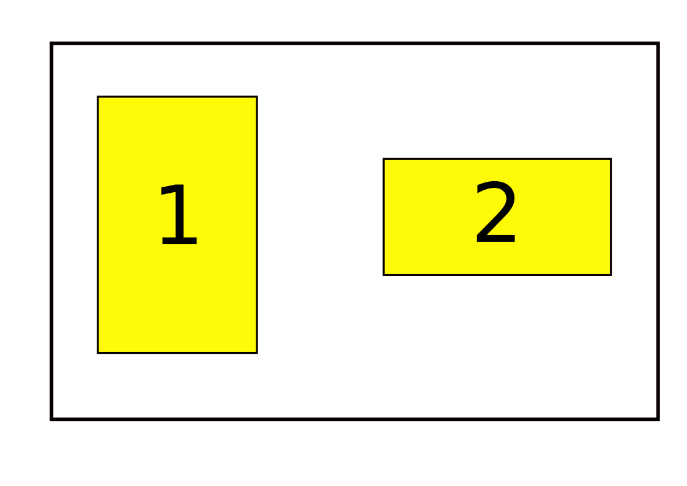
<figcaption>
Figura 13. Anchor Box
</figcaption>

Quando il nostro algoritmo si concentrerà su una cella potrebbe essere in grado di identificare due oggetti se questi possono essere inseriti ognuno in una differente Anchor Box.
Ovviamente per poter dare due differenti risultati, l’algoritmo dovrà restituire una array come quello seguente:

\begin{equation} 
\begin{bmatrix}
    p^1_c \\
    b^1_x \\
    b^1_y \\
    b^1_h \\
    b^1_w \\
    c^1_1 \\
    c^1_2 \\
    c^1_3 \\
    p^2_c \\
    b^2_x \\
    b^2_y \\
    b^2_h \\
    b^2_w \\
    c^2_1 \\
    c^2_2 \\
    c^2_3
\end{bmatrix}
\tag{2}
\end{equation}

Dove l'elemento $x^a$ farà riferimento all’Anchor Box $a$.
Grazie a questa potente introduzione ora Murphy avrà la possibilità di riconoscere entrambi gli oggetti legati al box centrale, come mostrato in figura 14, dove ED-209 viene asociato all'Anchor Box 1 mentra il scuolabus all'Anchor Box 2.

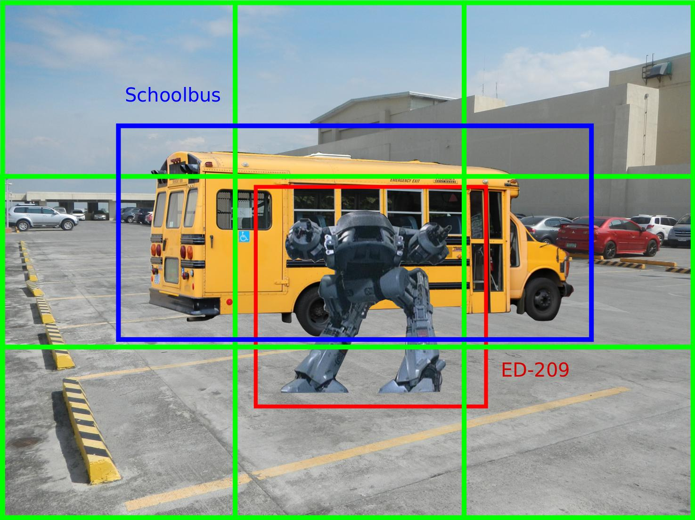
<figcaption>
Figura 14. ED-209 e lo scuolabus localizzati nel box centrale dell'immagine.
</figcaption>

Ovviamente questa separazione dovrà essere presente anche nel training set quindi, per costruirlo in maniera idonea, dovremo di volta in volta identificare l'Anchor Box migliore tra quelle che possono includere l'oggetto.
A questo scopo dovremmo introdurre un nuovo concetto, chiamato Intersection over Union (IoU).

### Intersection over Union

Immaginiamo di avere una immagine come quella in fig 11, di avere a disposizione le Anchor Box in figura 13 e di voler individuare quale tra queste è la migliore da associare a ED-209.
Entrambi i box sono idonei a contenere l'immagine, ma dovendone scegliere uno abbiamo bisogno di un meccanismo automatico che ci permetta di selezionare il migliore.
La IoU tra due aree, A e B, corrisponde al valore restituito dalla seguente formula:

\begin{equation} 
IoU(A,B) = \frac{A \cap B}{A \cup B}
\tag{4}
\end{equation}

Questo valore oscilla tra 0 e 1, dove 1 corrisponde ad una sovrapposizione perfetta tra le aree (quando l'unione e l'intersezione hanno lo stesso valore le due aree coincidono).

Per capire quale dei due anchor box sia il migliore prendiamo come riferimento il Bounding Box effettivo dell'immagine: l'anchor box che ha con questo il valore maggiore di IoU sarà considerato il migliore.

## Costruzione dell'insieme delle anchor box

Come già detto la forma e le dimensioni delle anchor box sono definite a priori prima della fase di training.
Si potrebbe pensare di prendere una serie di aree che riescano, grosso modo, a coprire la maggior parte degli oggetti possibile, ma questo potrebbe portare ad avere una serie di box non utilizzati affatto e la cui presenza porterebbe solo discapito nella fase di prediction.
L'idea che invece hanno avuto gli ideatori di YOLO è stata quella di estrapolare le anchor box direttamente dal training set tramite clusterizzazione delle Bounding Box.
Nello specifico è stato utilizzato un K-means con diversi valori di k e la seguente metrica di distanza:

$d(box, centroid) = 1 - IoU(box, centroid)$

Il motivo per il quale non viene utilizzata la distanza euclidea è che, sperimentalmente, questa portava i box più grandi a generare più errori di quelli piccoli.

<h2> Interpretazione del vettore di output</h2>

<h3>Coordinate della posizione e dimensione di una Bounding Box</h3>

Il vettore (1) contiene i dettagli relativi alla posizione dell'oggetto e alla dimensione della Bounding Box che lo contiene.
Questi valori sono calcolati relativamente alla cella nella quale l'oggetto è stato trovato e sono ricavati in maniera non banale, come illustrato in figura Fig. 15.

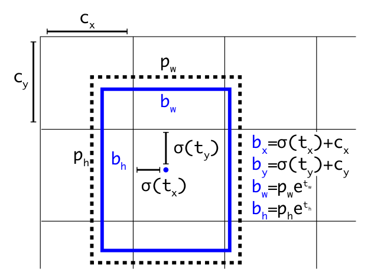
<figcaption>
Figura 15. Visualizzazione delle coordinate e della dimensione come conosciuta dall'algoritmo YOLO.
</figcaption>

Dove $t_x$, $t_y$, $t_w$ e $t_h$ sono i valori predetti dalla rete. Il rettangolo tratteggiato è la anchor box di riferimento mentre quello blu e la Bounding Box predetta.
$\sigma(t_n)$ sta ad indicare la [funzione logistica](https://it.wikipedia.org/wiki/Equazione_logistica) che limita il valore delle coordinate tra 0 e 1.

### Probabilità della presenza di un oggetto

I primi valori del vettore (2) associati ad ogni Anchor Box, che stanno ad indicare la probabilità della presenza o meno di un oggetto all'interno della Anchor Box, vengono calcolato nel modo seguente:

\begin{equation} 
Pr(object) * IoU (b, object) = \sigma(p_c)
\tag{3}
\end{equation}

Dove la probabilità di aver trovato un oggetto viene moltiplicata con il valore della IoU tra il Bounding Box reale e quella predetto dalla rete.
In questo modo la probabilità della presenza dell'oggetto viene pesata, in qualche modo, tramite la sovrapposizione dei due box, in modo da dare meno peso ai casi nei quali l'oggetto, pur avendo una buona probablità di essere presente nell'immagine, ha una Bounding Box troppo dissimile da quella reale.
Questa idea, introdotta già nella prima versione dello YOLO, viene chiamata dagli autori del paper "objectness", ma considerando quanta confusione potrebbe portare l'utilizzo della sua traduzione letterale, oggettività, si è deciso di non tradurlo, o meglio, di non usarlo affatto.

### Class prediction

I valori $C_1$, $C_2$ e $C_3$ del vettore di output stanno ad indicare la probabilità di appartenenza ad una determinata classe. Contrariamente, però, a quanto si possa suppore YOLO, nella sua ultima versione, non utilizza una softmax ma ogni valore viene calcolato tramite logistic classifier indipendenti. Questo ha permesso di poter gestire casi in cui l'oggetto contenuto nel box può appartenere a due classi sovrapposte come, ad esempio, cane e animale.

## Predictions across scales

Infine, sempre nella versione 3, è stata introdotta una modifica che rende lo YOLO in grado di predire i Bounding Box con 3 differenti "scale" utilizzando un meccanismo simile al [feature pyramid networks](https://arxiv.org/pdf/1612.03144.pdf). 

## Conclusione

YOLO è un ottimo algoritmo di Object Detection, probabilmente uno dei migliori attualmente esistenti.
La capacità di riconoscere e localizzare un oggetto in una immagine ha senza dubbio un numero smisurato di applicazioni, e non posso che accordarmi con i suoi inventori che, in chiusura del terzo paper, hanno espresso la speranza che le suddette applicazioni abbiano scopi non meno che utili e benevoli.

> "... computer vision is already being put to questionable use and
as researchers we have a responsibility to at least consider
the harm our work might be doing and think of ways to mitigate it. We owe the world that much." --YOLOv3: An Incremental Improvement by Joseph Redmon and Ali Farhadi--

## Riferimenti

* [You Only Look Once: Unified, Real-Time Object Detection](https://arxiv.org/abs/1506.02640)
* [YOLO9000: Better, Faster, Stronger](https://arxiv.org/abs/1612.08242)
* [YOLOv3: An Incremental Improvement](https://arxiv.org/abs/1804.02767)
* [YOLOv3: Darknet implementation](https://pjreddie.com/darknet/yolo/)

---
Se questo articolo ti è piaciuto e vuoi tenerti aggiornato sulle nostre attività, ricordati che l'[iscrizione all'Italian Association for Machine Learning](/member) è gratuita! Puoi seguirci su [Facebook](https://www.facebook.com/machinelearningitalia/), [LinkedIn](https://www.linkedin.com/company/iaml/), e [Twitter](https://twitter.com/iaml_it).